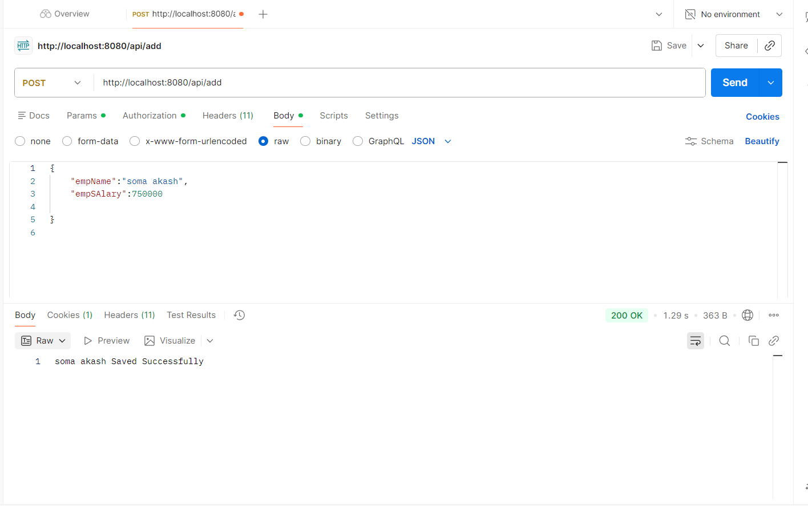
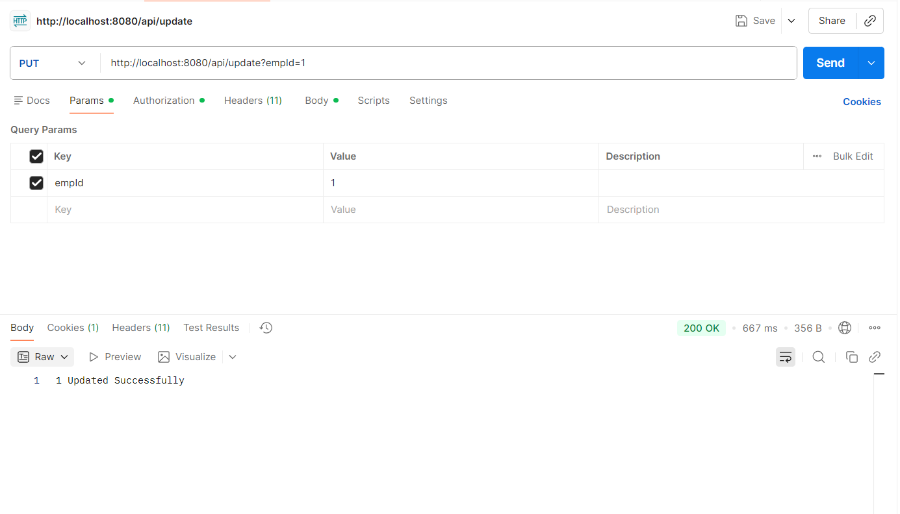
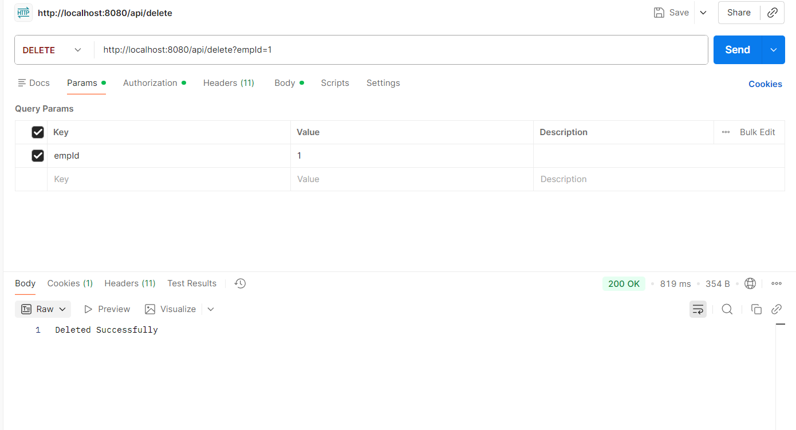
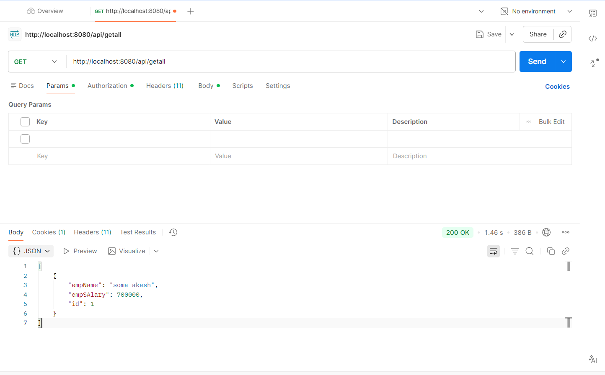

# 🔐 Spring Boot Data JPA REST Security – Employee Management API

A secure Employee Management REST API built using:

- Spring Boot 4
- Spring Data JPA
- Hibernate ORM
- MySQL
- Spring Security (HTTP Basic Authentication)
- Lombok
- Postman (for API testing)

---

## 📌 Project Overview

This project demonstrates:

- REST API development
- CRUD operations using Spring Data JPA
- MySQL database integration
- Spring Security configuration
- Layered architecture (Controller → Service → Repository → Database)

All API endpoints are secured using **HTTP Basic Authentication**.

---

## 🏗️ Project Architecture

```
Controller  →  Service  →  Repository (DAO)  →  Database
```

### Layers Explained

**Controller Layer**
- Handles HTTP requests and responses.

**Service Layer**
- Contains business logic.

**Repository Layer**
- Extends JpaRepository to perform database operations.

**Entity Layer**
- Represents database table structure.

---

## 🗄️ Database Setup

### Step 1: Create Database

```sql
CREATE DATABASE springbootdatajparestsecurity;
```

### Step 2: Configure application.properties

```properties
spring.datasource.url=jdbc:mysql://localhost:3306/springbootdatajparestsecurity
spring.datasource.username=root
spring.datasource.password=your_password

spring.jpa.hibernate.ddl-auto=update
spring.jpa.show-sql=true
spring.jpa.database-platform=org.hibernate.dialect.MySQLDialect
```

---

### Security Features

- All endpoints require authentication
- Uses HTTP Basic Authentication
- CSRF disabled (for REST API testing)
- Spring generates a temporary password on startup

Example console output:

```
Using generated security password: xxxxxxxx-xxxx-xxxx
```

Use:
- Username: `user`
- Password: generated password

---

# 📡 REST API Endpoints

Base URL:

```
http://localhost:8080/api
```

---

## 1️⃣ Add Employee

**POST** `/api/add`
<p align="center">
  
</p>
---

## 2️⃣ Update Employee

**PUT** `/api/update?empId=1`

<p align="center">
  
</p>


---

## 3️⃣ Delete Employee

**DELETE** `/api/delete?empId=1`

<p align="center">
  
</p>
---

## 4️⃣ Get Employee

**GET** `/api/get?empId=1`

<p align="center">
  
</p>

---

# 🛠 Technologies Used

| Technology | Purpose |
|------------|----------|
| Spring Boot | Application framework |
| Spring Data JPA | Database interaction |
| Hibernate | ORM |
| MySQL | Database |
| Spring Security | Authentication |
| Lombok | Boilerplate reduction |
| Postman | API Testing |

---

# ▶️ How To Run

1. Clone repository
```
git clone https://github.com/your-username/project-name.git
```

2. Create MySQL database
```
springbootdatajparestsecurity
```

3. Update database credentials in application.properties

4. Run the application

5. Test APIs using Postman with:
   - Username: user
   - Password: generated password from console

---

# 🎯 Key Learning Outcomes

- Implemented secure REST APIs
- Integrated Spring Security with HTTP Basic
- Performed CRUD operations using Spring Data JPA
- Understood layered architecture
- Tested APIs using Postman

---

# 👨‍💻 Author

**P. Soma Akash**  
Java Full Stack Trainee at [Codegnan](https://codegnan.com/)

---

# ⭐ Conclusion

This project demonstrates:

- Spring Boot REST API development
- Secure endpoint configuration
- MySQL database integration
- Complete CRUD functionality

---

# Acknowledgement
Grateful to my trainer [Sathya Prakash sir](https://github.com/sathyasoma) for invaluable guidance and support throughout my Java Full Stack training.

